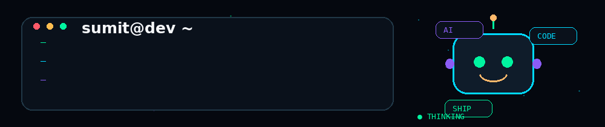

 

<!-- CUSTOM ENGINEERING ANIMATION -->

  

  

  

&nbsp;

&nbsp;

  

 

### `BUILDING PRODUCTS • SOLVING SYSTEMS • EXPLORING AI`

---

# 🧬 `ENGINEER PROFILE`

<table>
<tr>

<td width="60%" valign="top">

### 👋 Hey, I'm Sumit

I'm a **Computer Science Engineer** focused on building full-stack applications, AI-powered products, and real-world software systems.

I enjoy working across the stack — from interfaces and APIs to **databases, concurrency, real-time communication, AI integration, and application architecture**.

I'm also experienced with **Java and SAP ABAP** for enterprise application development.

My goal is simple:

> **Build software that is useful, technically interesting, and worth using.**

### ⚡ Currently

- 🤖 Exploring **AI Agents & LLM Applications**
- 🚀 Building **full-stack products**
- 🧠 Strengthening **C++ & DSA**
- ⚙️ Learning **System Design & scalable architecture**
- ☁️ Improving **Cloud & DevOps**

</td>

<td width="40%" align="center">

  

  

</td>

</tr>
</table>

---

# ⚡ `WHAT I BUILD`

<table>
<tr>

<td align="center" width="25%">

### 🤖

**AI SYSTEMS**

Agents  
LLMs  
RAG  
GenAI

</td>

<td align="center" width="25%">

### ⚙️

**BACKEND**

APIs  
Databases  
Auth  
Concurrency

</td>

<td align="center" width="25%">

### 🌐

**FULL-STACK**

React  
Next.js  
TypeScript  
Products

</td>

<td align="center" width="25%">

### 🔄

**REAL-TIME**

WebSockets  
WebRTC  
P2P  
Live Systems

</td>

</tr>
</table>

---

# 🚀 `FEATURED WORK`

### Selected products, systems & experiments I've built.

 

<!-- SMARTSLOT -->

<table>
<tr>

<td width="45%" align="center">

  

</td>

<td width="55%" valign="top">

## 🟢 SmartSlot

### Real-Time Booking Engine

A high-concurrency booking platform engineered around reliable reservation handling and real-time updates.

**Stack**

`ASP.NET Core 8` · `React` · `TypeScript` · `PostgreSQL` · `WebSockets`

**Engineering**

- 🔒 Database-level locking
- ⚡ Concurrency control
- 📡 Real-time updates
- 🏗️ Clean architecture
- 📊 Admin dashboard

 

</td>

</tr>
</table>

---

<!-- SWIFTPDF -->

<table>
<tr>

<td width="55%" valign="top">

## 🔵 SwiftPDF

### Full-Stack Document Suite

A modern document-processing platform bringing a large collection of PDF workflows into one product experience.

**Stack**

`Next.js` · `React` · `TypeScript` · `FastAPI` · `Docker`

**Highlights**

- 📄 42+ document tools
- ⚡ Document processing
- 🧩 API-driven architecture
- 🐳 Dockerized backend
- 📱 Responsive UI

 

</td>

<td width="45%" align="center">

  

</td>

</tr>
</table>

---

<!-- NEXAPILOT -->

<table>
<tr>

<td width="45%" align="center">

  

</td>

<td width="55%" valign="top">

## 🟣 NexaPilot

### AI Productivity Co-Pilot

An AI productivity system built around agents, tools, memory, orchestration and multimodal interaction.

**Stack**

`Python` · `AI Agents` · `LLMs` · `SQLite` · `TTS`

**Engineering**

- 🧠 Agent orchestration
- 💾 Persistent memory
- 🧰 Tool execution
- ⚡ Streaming
- 🎙️ Voice interaction

 

</td>

</tr>
</table>

---

<!-- KAVACH AI -->

<table>
<tr>

<td width="55%" valign="top">

## 🛡️ Kavach AI

### AI + Cybersecurity Platform

An intelligent security platform for analyzing URLs, messages, voice transcripts and visual content.

**Stack**

`Next.js` · `React` · `TypeScript` · `Tailwind CSS` · `Leaflet`

**Highlights**

- 🔍 URL scanner
- 💬 SMS analyzer
- 🎙️ Voice analysis
- 🗺️ Threat heatmap
- 🤖 AI assistant
- 📊 Security dashboard

 

</td>

<td width="45%" align="center">

  

</td>

</tr>
</table>

---

<!-- AETHER -->

<table>
<tr>

<td width="45%" align="center">

  

</td>

<td width="55%" valign="top">

## 🟠 Aether

### P2P Synchronization Engine

A local-first peer-to-peer sharing system combining direct WebRTC communication with relay fallback.

**Transfer Flow**

`WebRTC → Socket.IO Relay → HTTP + QR → Web Share`

**Stack**

`WebRTC` · `Socket.IO` · `Node.js` · `Express`

**Engineering**

- 🔗 P2P communication
- 🔄 Relay fallback
- ⚡ Real-time sync
- 📱 QR sharing
- 🌐 WebRTC

 

</td>

</tr>
</table>

---

<!-- QUIZIFY AI -->

<table>
<tr>

<td width="55%" valign="top">

## 🟢 QuizifyAI

### Generative AI Learning Platform

Transforms study material into interactive quizzes, flashcards and AI-powered explanations.

**Stack**

`React` · `Gemini AI` · `Firebase` · `JavaScript` · `PWA`

**Highlights**

- 📄 PDF → Quiz
- 🤖 AI generation
- 🧠 AI explanations
- 🃏 Flashcards
- 🏆 Gamification
- ☁️ Firebase

 

</td>

<td width="45%" align="center">

</td>

</tr>
</table>

---

# 🧪 `EXPERIMENTAL LAB`

### Smaller products, creative interfaces & engineering experiments

 

<table>
<tr>

<td align="center" width="25%">

### 📝 Aura Notes

Offline-first productivity experience

`PWA` · `Audio` · `Canvas`

</td>

<td align="center" width="25%">

### 🎨 Aura Studio

Creative canvas & visual editor

`Canvas` · `UI` · `Frontend`

</td>

<td align="center" width="25%">

### 🧠 ASTRA

AI-focused career experience

`React` · `AI` · `TTS`

</td>

<td align="center" width="25%">

### 🏛️ Virasat-Vani

AI + heritage platform

`AI` · `Maps` · `PWA`

</td>

</tr>
</table>

---

# 🧠 `ENGINEERING DEPTH`

 

  

<table>
<tr>

<td align="center" width="33%">

### 🔐 Concurrency

`Transactions`  
`Database Locking`  
`Race Conditions`  
`Consistency`

</td>

<td align="center" width="33%">

### 🌐 Real-Time

`WebSockets`  
`WebRTC`  
`Socket.IO`  
`P2P`

</td>

<td align="center" width="33%">

### 🤖 Intelligence

`Agents`  
`LLMs`  
`Memory`  
`GenAI`

</td>

</tr>

<tr>

<td align="center">

### 🏗️ Architecture

`REST APIs`  
`Service Design`  
`Data Flow`

</td>

<td align="center">

### 🗄️ Data

`PostgreSQL`  
`MongoDB`  
`Firebase`  
`SQLite`

</td>

<td align="center">

### ☁️ Deployment

`Docker`  
`AWS`  
`Linux`  
`CI/CD`

</td>

</tr>
</table>

---

# 🛠️ `TECH STACK`

### 💻 Languages

  

  

### 🎨 Frontend

  

### ⚙️ Backend & APIs

  

### 🗄️ Database & Cloud

  

### ☁️ DevOps & Tools

---

# ⚡ `THE ENGINEERING LOOP`

 

---

# 📡 `SYSTEM TELEMETRY`

 

&nbsp;&nbsp;

  

---

# 🐍 `CONTRIBUTION FLOW`

---

# 🌌 `CURRENTLY EXPLORING`

 

---

# 🧩 `PROBLEM SOLVING`

 

&nbsp;

&nbsp;

  

`C++` · `Java` · `ABAP` · `DSA` · `Algorithms` · `Problem Solving`

---

 

# 🤝 `LET'S BUILD SOMETHING`

 

**Software Engineering · Full-Stack Development · AI Engineering · Backend · Enterprise Development · Scalable Systems**

  

&nbsp;

  

  

